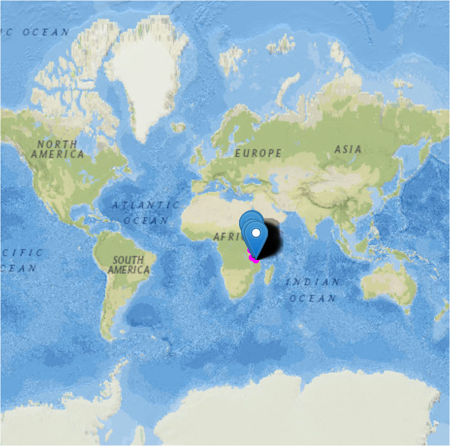
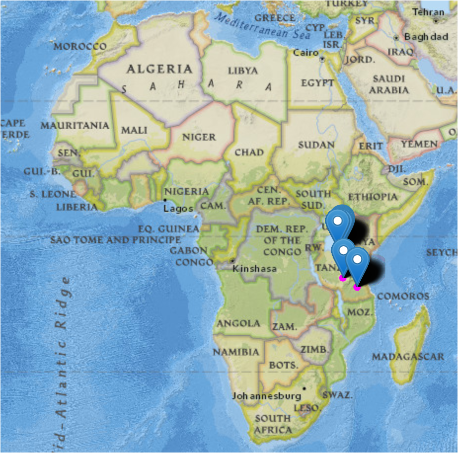
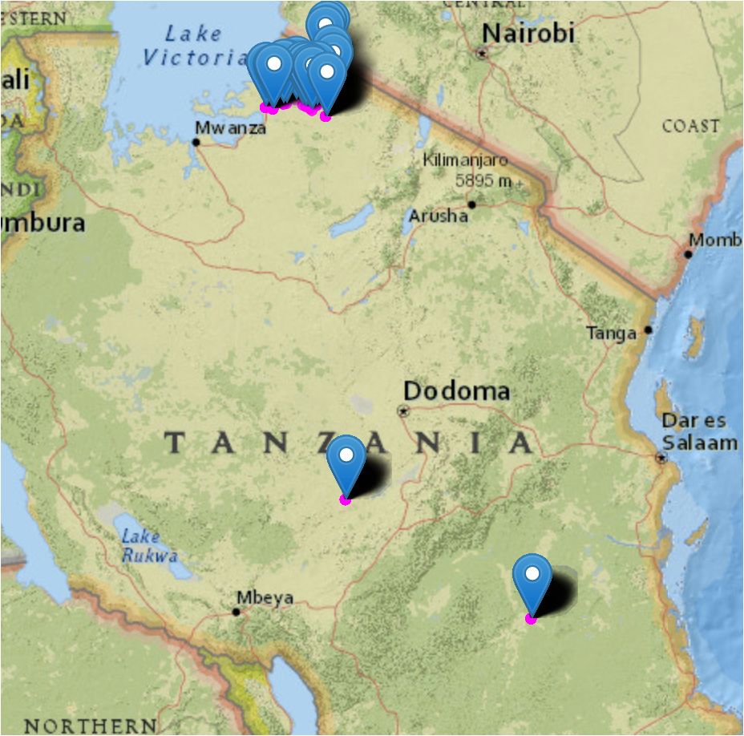
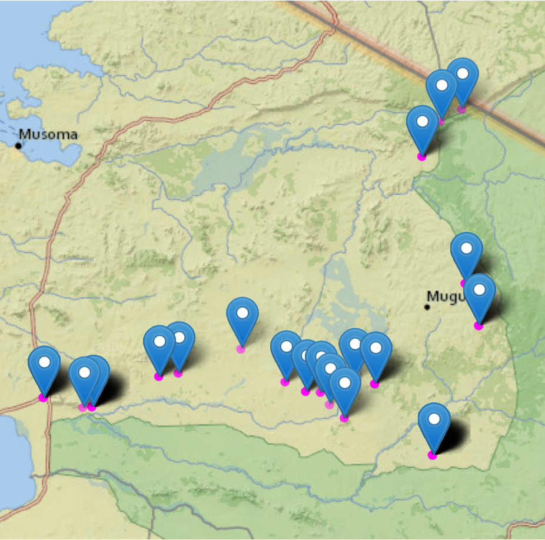

# Sample Metadata {#sample-metadata}

## What is metadata?
* <b>Metadata</b> is a set of data that describes and provides information about other data. It is commonly defined as **data about data**.
* **Sample metadata** described in this book refers to the description and context of the individual sample collected for a specific microbiome study.

## Metadata structure
* Metadata collected at different stages (Figure 1) are typically organized in an Excel or Google spreadsheet where:
  * The metadata table columns represent the properties of the samples.
  * The metadata table rows contain information associated with the samples.
  * Typically, the first column of sample metadata is Sample ID, which designates the key associated to individual sample
  * Sampl ID must be unique.

## Embedded metadata
* In most cases, you will find the metadata detached from the experimental data.
* Embedded metadata integrates the experimental data especially for graphics.
* Major microbiome analysis platforms require sample metadata, commonly referred to as **mapping file** when performing downstream analysis.

<br>

## Metadata profiling
```{block, type="tmbinfo", echo=TRUE}
Typically, after sequencing the microbiome DNA, the investigators are encouraged to deposit the sequence reads in a public repository. The Sequence Read Archive (SRA) is currently the best bioinformatics database for read information. The good thing about SRA is that it integrates data from the NCBI, the European Bioinformatics Institute (EBI), and the DNA Data Bank of Japan (DDBJ). 

```

Here we profile metadata associated with the bushmeat microbiome project number [PRJNA477349](https://www.ncbi.nlm.nih.gov/sra?linkname=bioproject_sra_all&from_uid=477349).

- We will demonstrate:
  - how to download metadata from the NCBI-SRA archive. 
  - how to read the metadata file into R environment. 
  - how to create a tidy dataframe.
  - how to select and filter desired metadata
  
### Downloading metadata using the NCBI-SRA run selector

{width=100%}
### Reading metadata into R environment
```{r warning=FALSE}
source("R/common.R")
sraruntable <- read_delim("data/SraRunTable.txt", show_col_types = FALSE)
```

### How many rows and columns
```{r}
paste("There are", dim(sraruntable)[1], "rows and", dim(sraruntable)[2],"columns in this metadata")
```

### Column names
Getting a clear knowledge about the variables associated with a sample metadata can help in filtering the most important features.
 
```{r}
colnames(sraruntable)
```

> Note that a fraction of the columns may be needed to answer all the research questions. 


## Tidying and subsetting metadata
- We want the sample metadata to include a few desired variables. 
- In this example we desire to include sample collection point i.e latitude and longitude. 
- We will drop row with `NA` in location column.
- It is a good habit to rename, modify or replace longer column names with meaningful names.
- We will select a few columns to create a desired metadata for downstream analyses.
- Saving the tidy metadata file in `RDS or RData` format will preserve a compressed file.

### Getting s desired metadata
```{r}
metadata <- sraruntable %>%  
  rename_all(tolower) %>% 
  rename(sample_id = run) %>% 
  drop_na(lat_lon) %>% 
  mutate(
    geo_loc_name = str_replace_all(geo_loc_name, "Tanzania: ", ""),
    geo_loc_name = str_replace_all(geo_loc_name, "The Greater Serengeti Ecosystem", "Serengeti"),
    geo_loc_name = str_replace_all(geo_loc_name, " Ecosystem", ""),
    isolate = str_replace_all(isolate, "_\\d*$", ""),
    lat_lon = str_replace_all(lat_lon, " E$", ""),
    latitude = as.numeric(str_replace_all(lat_lon, " S.*", "")) * -1,
    longitude = as.numeric(str_replace_all(lat_lon, ".*S ", ""))) %>% 
  rename(ecosystem = geo_loc_name) %>%
  rename(description = host) %>% 
  mutate(bases = round(bases/1E6, digits = 0)) %>% 
  select(sample_id, ecosystem, isolate, latitude, longitude, milionbases=bases, description)

saveRDS(metadata, "RDataRDS/metadata.rds")
```

### Compact structure of the tidy metadata
```{r}
str(metadata)
```


### Any missing values? 
The `df_status()` from funModeling R package is excellent for quick inspecting the variables, missing values, data type and total unique variables.

```{r}
library(funModeling)
metadata <- readRDS("RDataRDS/metadata.rds")
df_status(metadata)
```

Key: **q_zeros**: quantity of missing data; **p_zeros**: percentage of missing data, **q_na**: quantity of NA; **p_na**: percentage of NA, **q_inf**: quantity of infinite values; **p_inf**: percentage of infinity values,  **type**: factor, character, integer or numeric; **unique**: levels of the variable.


### Graphical view of variable frequency
- We can also use the `freq()` function from the funModeling R package to get a clear view of the variables and unique counts.

```{r var_freq}
freq(metadata, input = c("ecosystem", "isolate"))
```


<br>


### Which samples have the smallest number of reads?
- We want to use samples with smaller number of reads for computation reasons.
- Read depth is proportional to the number of bases (renamed to milionbases)
- Let's explore read depth across isolates and ecosystem.
- We will sort the bases in ascending order.

```{r fig.height=7, fig.width=7}
metadata %>% 
  select(isolate, ecosystem, milionbases) %>% 
  arrange(milionbases)
  
```

> Looks like the top samples with smallest number of reads are from same ecosystem.


<br>

### Distribution across common variable
```{r distrib}
metadata %>% 
  ggplot(aes(x = isolate, y = milionbases, fill = ecosystem)) +
  facet_grid(~ ecosystem) +
  geom_col(position = "dodge") +
  coord_flip() +
  labs(x = "Animal Name", y = "Bases (milion)") +
  theme_light()  + 
  nolegend +
  facetsize12 +
 axislayout
```

<br>

## Mapping sample collection points 
Sometimes it may be good to pinpoint sample collection point on geographical map for better feature comparison. The [`leaflet`](https://rstudio.github.io/leaflet/) R package can do a great job in dropping a pin on the corresponding coordinate. 

Let's give it a try. 

> Note that samples collected on the same coordinate will overlap. You can zoom in-out to expand or minimize the map. Mouse over the pin to see the variable label. 

```{r map}
library(leaflet)
library(leaflet.esri)
library(leaflet.providers)
library(leaflet.extras)
library(data.table)
library(dplyr)

minLat <- min(metadata$latitude) - 0.1
minLon <- min(metadata$longitude) + 0.1
maxLat <- max(metadata$latitude) + 0.1
maxLon <- max(metadata$longitude) + 0.1

metadata %>%
  leaflet() %>% 
  addProviderTiles(providers$Esri.NatGeoWorldMap) %>%
  fitBounds(minLon, minLat, maxLon, maxLat) %>%
  addMarkers(lng = ~longitude, lat = ~latitude, popup = ~isolate, label = ~ c(isolate)) %>%
  addCircles(color="magenta", radius = log1p(metadata$longitude) * 10)
```

<br>

### Example of screenshots from zoom in-out

{ width=60% }

<br>

{ width=60% }

<br>

{ width=60% }

<br>

{ width=60% }


```{r include=FALSE}
save(
  metadata,

  file = "RDataRDS/saved_objects.RData")
```
