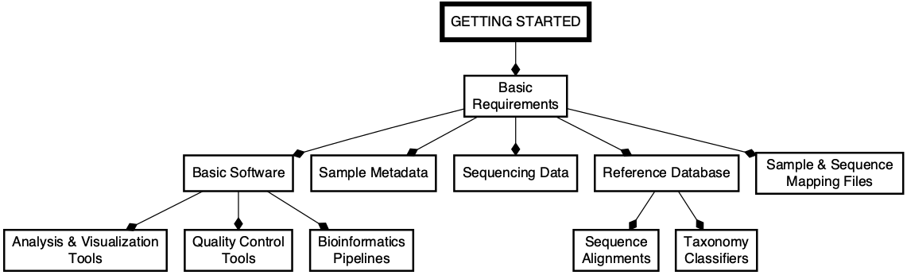

# iMAP-PART1: How to Get Started with Microbiome Data Analysis
The iMAP-PART1 is one of the <a class="text-light" href="https://complexdatainsights.com/books/microbiome-analysis/end-to-end-user-guide/">Systematic Microbiome Data Analysis (SMDA) User Guides</a>

 

The **Systematic Microbiome Data Analytics (SMDA) User Guides** are series intended to provide support in Microbiome Data Analytics beyond the traditional analysis. 

|Code| Description| Glimpse | Report |
|--------------------|---------------------------------------------|-----------|-------|
|[iMAP-PART1](https://github.com/tmbuza/microbiome-part1/) | How to Get Started with Microbiome Data Analysis |[GH-Page](https://tmbuza.github.io/microbiome-part1/) | [eBook](https://complexdatainsights.com/books/microbiome-analysis/getting-started) |

## Citation
Teresia M. Buza, Triza Tonui, Francesca Stomeo, Christian Tiambo, Robab Katani, Megan Schilling, Beatus Lyimo, Paul Gwakisa, Isabella M. Cattadori, Joram Buza and Vivek Kapur. iMAP: an integrated bioinformatics and visualization pipeline for microbiome data analysis. BMC Bioinformatics (2019) 20:374. [Free Full Text](https://rdcu.be/b5iVj).

