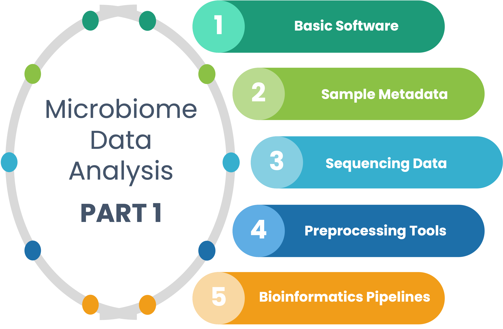

```{r pkgbiblib, include=FALSE}
knitr::write_bib(c(
  .packages(), 'base','bookdown','rmarkdown','tidyverse','shiny','vegan','data.table, dendextend, robCompositions, microbiome, ALDEx2, caret, rms, phyloseq'
), 'library/packages.bib')
```

```{r setup, include=FALSE}
source(file = "R/common.R")
```

# Getting Started with Microbiome Data Analysis in R {-#frontpage}

```{r include=FALSE}
library(DiagrammeR)
library(DiagrammeRsvg)

graph <- DiagrammeR::grViz("
digraph {
graph [layout = dot, rankdir = TD]

node [
shape = box, 
style = filled, 
fillcolor = white, 
fontname = Helvetica,
penwidth = 2.0] 

edge [arrowhead = diamond]

A [label = 'Getting Started', fillcolor = white, penwidth = 5.0]
B [label = 'Basic Requirements']
C [label = 'Sample Metadata']
D [label = 'Software']
E [label = 'Sequencing Data']
F [label = 'Data Analysis Tools']
G [label = 'Preprocessing Tools']
H [label = 'Bioinformatics Pipelines']

{A}  -> B
{B}  -> C
{B}  -> D
{B}  -> E
{D}  -> F
{D}  -> G
{D}  -> H

}", height = 400, width = 600)

### Visualize the graph object
graph
```


<a href=""></a>

<h2>Quick Glimpse</h2>

Microbial communities play a vital role in human health and disease. Investigating the role of microbial communities in health and disease requires a thorough knowledge of the analytical process. We provide step-by-step analytics guides to enable the user to understand the microbial composition present in a given sample. This is <b>PART 1</b> of the microbiome data analysis workflows intended to help users getting started. A code for part 1 is available at a public [GitHub repository](https://github.com/tmbuza/microbiome-part1/). You can request a consulting service by contacting the developer using <a href="https://complexdatainsights.com/contact-us">this contact form</a>. 


<h2>License</h2>

{ width=100px } The online version of this book is free and licensed under a <a rel="license" href="http://creativecommons.org/licenses/by-nc-nd/4.0/">Creative Commons Attribution-NonCommercial-NoDerivatives 4.0 International License</a>

<!--chapter:end:index.Rmd-->

# (PART) GETTING STARTED {-}

# Basic Software {#basic-software}
## Install R Environments {#Renv}

<a href=""></a>
**R** is a free software for statistical computing, data analysis, and graphics [@RCoreTeam2021]. We need to install R application on a personal computer to process the R programming language. You can download and install R using these steps:

1. Go to [https://www.r-project.org/](https://www.r-project.org/).
2. On the left, under Download, click on [CRAN](http://cran.r-project.org/mirrors.html) to access the mirrors. CRAN (Comprehensive R Archive Network) is mirrored on nearly 100 registered servers in nearly 50 regions world. See [CRAN mirror status](https://cran.r-project.org/mirmon_report.html).
3. https://cloud.r-project.org/ Pick a mirror that is close to your location, and automatically R will connect to that server ready to download the package files.
4. Select a compatible platform to download precompiled binary distributions of the base system, which also come with contributed packages.

<br>

## Install RStudio Environments {#rstudio}

<a href=""></a>

**RStudio** is a free program that integrates with R as an IDE (Integrated Development Environment) to implement most of the analytical functionalities [@RStudioTeam2021].  For effective analysis, we must install R before installing RStudio. We will intensively use RStudio IDE to give us a user interface. We are interested in **RStudio Desktop**, which is the open-source regular desktop application. You can install it like this:

1. Go to [https://rstudio.com/products/rstudio/](https://rstudio.com/products/rstudio/).
2. Click on [RStudio Desktop](https://rstudio.com/products/rstudio/#rstudio-desktop) box to move to the open source edition.
3. Choose your preferred [license](https://rstudio.com/products/rstudio/download/) either open source or commercial.
4. Select [installer](https://rstudio.com/products/rstudio/download/#download) compatible to your operating system.

<br>

{ width=100% }

<br>

## Install R packages {#installpkgs}
Install basic packages that get the analysis started. We will introduce additional packages within the subsequent sections whenever needed

**Description of selected packages**

| Package | Description |
| :--------------------- | :---------------------------------------------- |
| [tidyverse](https://www.rdocumentation.org/packages/tidyverse/) | The *tidyverse* package is a collection of R packages designed with common APIs. It includes *readr*, *dplyr*, *tidyr*, *ggplot2*, *tibble*, *purr*, etc. |
| [readr](https://www.rdocumentation.org/packages/readr/) | The *readr* package turns flat files into data frames |
| [dplyr](https://www.rdocumentation.org/packages/dplyr/) | The *dplyr* package focuses on data frames. We will use dplyr (a lot) to subset, summarize, rearrange, and to join together data sets. |
| [tidyr](https://www.rdocumentation.org/packages/tidyr/) | The *tidyr* package converts data into the tidy format where each variable is a column, each observation is a row, and each type of observational unit is a table. |
| [ggplot2](https://www.rdocumentation.org/packages/ggplot2/) | The *ggplot2* functions create elegant graphics based on the Grammar of Graphics. |
| [knitr](https://www.rdocumentation.org/packages/knitr/) | The *knitr* package is excellect for integrating R code into different forms of Literate Programming to generate dynamic reports. |
| [magrittr](https://www.rdocumentation.org/packages/magrittr/) | The *magrittr* provides an operator ( %>% ) for chaining several commands. |
| [purr](https://www.rdocumentation.org/packages/purrr/) | The *purr* provides tools for working with functions and vectors. |
| [forcat](https://www.rdocumentation.org/packages/forcats/) | The *forcats* provide functions for solving common problems with factors. |


```{block, type="tmbinfo", echo=TRUE}
**Location of R packages used in this Book**

* [CRAN](https://cran.r-project.org/) (Comprehensive R Archive Network): The official repository. Reviewed!
* [Bioconductor](https://www.bioconductor.org/): Most popular repository for bioinformatics software. Reviewed!
* [Github](https://github.com/): Most popular repository for open source projects. Not Reviewed!
```


**Installing and loading packages from CRAN**
```{}
install.packages("packagename")
library("packagename")
```


**Installing and loading R packages from Bioconductor**
```{}
# Install BiocManager
if (!requireNamespace("BiocManager", quietly = TRUE)) install.packages("BiocManager")
library("BiocManager")

# Then install packages like this:
BiocManager::install("packagename")}
library("packagename")
```


**Installing and loading R packages from GitHub**.

```{}
# Install devtools from CRAN
install.packages("devtools")
library(devtools)

# Or the development version from GitHub:
devtools::install_github("r-lib/devtools")
library(devtools)

# Then install any GitHub package like this:

devtools::install_github("githubID/packagename")
library("packagename")
```


## Getting Help in R

**Show basic package information**

```{}
help("packagename")

or

?packagename

help(package = "packagename")

```

**Get a general overview of a function, including an example code**

```{}
help(functionname)

or

help(functionname, package = "packagename")

```

**Remove unneeded packages from your computer**

```{}
remove.packages("packagename")
```

**Unload a package**

```{}
detach("package::packagename")
```

## Citation Information
Run on R console command line
```{}
# Citing R\n
citation()

# Citing RStudio
library(rstudioapi)
versionInfo()$citation

# Citing Package ...example
citation("tidyverse")
```

## Useful links

1. R Packages: [https://www.datacamp.com/community/tutorials/r-packages-guide](https://www.datacamp.com/community/tutorials/r-packages-guide).
2. Search CRAN, Bioconductor and GitHub packages and functions: [https://www.rdocumentation.org/](https://www.rdocumentation.org/).


<!--chapter:end:01a_basic_software.Rmd-->

# Sample Metadata {#sample-metadata}

## What is metadata?
* <b>Metadata</b> is a set of data that describes and provides information about other data. It is commonly defined as **data about data**.
* **Sample metadata** described in this book refers to the description and context of the individual sample collected for a specific microbiome study.

## Metadata structure
* Metadata collected at different stages (Figure 1) are typically organized in an Excel or Google spreadsheet where:
  * The metadata table columns represent the properties of the samples.
  * The metadata table rows contain information associated with the samples.
  * Typically, the first column of sample metadata is Sample ID, which designates the key associated to individual sample
  * Sampl ID must be unique.

## Embedded metadata
* In most cases, you will find the metadata detached from the experimental data.
* Embedded metadata integrates the experimental data especially for graphics.
* Major microbiome analysis platforms require sample metadata, commonly referred to as **mapping file** when performing downstream analysis.

<br>

## Metadata profiling
```{block, type="tmbinfo", echo=TRUE}
Typically, after sequencing the microbiome DNA, the investigators are encouraged to deposit the sequence reads in a public repository. The Sequence Read Archive (SRA) is currently the best bioinformatics database for read information. The good thing about SRA is that it integrates data from the NCBI, the European Bioinformatics Institute (EBI), and the DNA Data Bank of Japan (DDBJ). 

```

Here we profile metadata associated with the bushmeat microbiome project number [PRJNA477349](https://www.ncbi.nlm.nih.gov/sra?linkname=bioproject_sra_all&from_uid=477349).

- We will demonstrate:
  - how to download metadata from the NCBI-SRA archive. 
  - how to read the metadata file into R environment. 
  - how to create a tidy dataframe.
  - how to select and filter desired metadata
  
### Downloading metadata using the NCBI-SRA run selector

{width=100%}
### Reading metadata into R environment
```{r warning=FALSE}
source("R/common.R")
sraruntable <- read_delim("data/SraRunTable.txt", show_col_types = FALSE)
```

### How many rows and columns
```{r}
paste("There are", dim(sraruntable)[1], "rows and", dim(sraruntable)[2],"columns in this metadata")
```

### Column names
Getting a clear knowledge about the variables associated with a sample metadata can help in filtering the most important features.
 
```{r}
colnames(sraruntable)
```

> Note that a fraction of the columns may be needed to answer all the research questions. 


## Tidying and subsetting metadata
- We want the sample metadata to include a few desired variables. 
- In this example we desire to include sample collection point i.e latitude and longitude. 
- We will drop row with `NA` in location column.
- It is a good habit to rename, modify or replace longer column names with meaningful names.
- We will select a few columns to create a desired metadata for downstream analyses.
- Saving the tidy metadata file in `RDS or RData` format will preserve a compressed file.

### Getting s desired metadata
```{r}
metadata <- sraruntable %>%  
  rename_all(tolower) %>% 
  rename(sample_id = run) %>% 
  drop_na(lat_lon) %>% 
  mutate(
    geo_loc_name = str_replace_all(geo_loc_name, "Tanzania: ", ""),
    geo_loc_name = str_replace_all(geo_loc_name, "The Greater Serengeti Ecosystem", "Serengeti"),
    geo_loc_name = str_replace_all(geo_loc_name, " Ecosystem", ""),
    isolate = str_replace_all(isolate, "_\\d*$", ""),
    lat_lon = str_replace_all(lat_lon, " E$", ""),
    latitude = as.numeric(str_replace_all(lat_lon, " S.*", "")) * -1,
    longitude = as.numeric(str_replace_all(lat_lon, ".*S ", ""))) %>% 
  rename(ecosystem = geo_loc_name) %>%
  rename(description = host) %>% 
  mutate(bases = round(bases/1E6, digits = 0)) %>% 
  select(sample_id, ecosystem, isolate, latitude, longitude, milionbases=bases, description)

saveRDS(metadata, "RDataRDS/metadata.rds")
```

### Compact structure of the tidy metadata
```{r}
str(metadata)
```


### Any missing values? 
The `df_status()` from funModeling R package is excellent for quick inspecting the variables, missing values, data type and total unique variables.

```{r}
library(funModeling)
metadata <- readRDS("RDataRDS/metadata.rds")
df_status(metadata)
```

Key: **q_zeros**: quantity of missing data; **p_zeros**: percentage of missing data, **q_na**: quantity of NA; **p_na**: percentage of NA, **q_inf**: quantity of infinite values; **p_inf**: percentage of infinity values,  **type**: factor, character, integer or numeric; **unique**: levels of the variable.


### Graphical view of variable frequency
- We can also use the `freq()` function from the funModeling R package to get a clear view of the variables and unique counts.

```{r var_freq}
freq(metadata, input = c("ecosystem", "isolate"))
```


<br>


### Which samples have the smallest number of reads?
- We want to use samples with smaller number of reads for computation reasons.
- Read depth is proportional to the number of bases (renamed to milionbases)
- Let's explore read depth across isolates and ecosystem.
- We will sort the bases in ascending order.

```{r fig.height=7, fig.width=7}
metadata %>% 
  select(isolate, ecosystem, milionbases) %>% 
  arrange(milionbases)
  
```

> Looks like the top samples with smallest number of reads are from same ecosystem.


<br>

### Distribution across common variable
```{r distrib}
metadata %>% 
  ggplot(aes(x = isolate, y = milionbases, fill = ecosystem)) +
  facet_grid(~ ecosystem) +
  geom_col(position = "dodge") +
  coord_flip() +
  labs(x = "Animal Name", y = "Bases (milion)") +
  theme_light()  + 
  nolegend +
  facetsize12 +
 axislayout
```

<br>

## Mapping sample collection points 
Sometimes it may be good to pinpoint sample collection point on geographical map for better feature comparison. The [`leaflet`](https://rstudio.github.io/leaflet/) R package can do a great job in dropping a pin on the corresponding coordinate. 

Let's give it a try. 

> Note that samples collected on the same coordinate will overlap. You can zoom in-out to expand or minimize the map. Mouse over the pin to see the variable label. 

```{r map}
library(leaflet)
library(leaflet.esri)
library(leaflet.providers)
library(leaflet.extras)
library(data.table)
library(dplyr)

minLat <- min(metadata$latitude) - 0.1
minLon <- min(metadata$longitude) + 0.1
maxLat <- max(metadata$latitude) + 0.1
maxLon <- max(metadata$longitude) + 0.1

metadata %>%
  leaflet() %>% 
  addProviderTiles(providers$Esri.NatGeoWorldMap) %>%
  fitBounds(minLon, minLat, maxLon, maxLat) %>%
  addMarkers(lng = ~longitude, lat = ~latitude, popup = ~isolate, label = ~ c(isolate)) %>%
  addCircles(color="magenta", radius = log1p(metadata$longitude) * 10)
```

<br>

### Example of screenshots from zoom in-out

{ width=60% }

<br>

{ width=60% }

<br>

{ width=60% }

<br>

{ width=60% }


```{r include=FALSE}
save(
  metadata,

  file = "RDataRDS/saved_objects.RData")
```

<!--chapter:end:01b_samplemetadata.Rmd-->

# Sequencing Data {#sequencing-data}

Sequencing data may include:

1. Research projects
2. From Sequence Read Archive (SRA)
3. In `silico` simulation


## From research projects
The most common sources of sequencing data are from research projects. There are multiple sequencing platforms out there. For example, Illumina sequencing company uses technologies capable of profiling entire microbial communities present in environmental. Example include: 

- 16S rRNA Sequencing
- Shotgun Metagenomic Sequencing

## From archives such as NCBI-SRA
The NCBI Sequence Read Archive (SRA) stores sequencing data from the next generation sequencing platforms. Users can download data from the SRA archive. Below are minimal steps to do that:

### Install SRA Toolkit on Mac OS.
- Navigate to where you want to install the tools, preferably the home directory.
- For more information click [here](https://github.com/ncbi/sra-tools/wiki/02.-Installing-SRA-Toolkit).

```{}
curl -LO  https://ftp-trace.ncbi.nlm.nih.gov/sra/sdk/3.0.0/sratoolkit.3.0.0-mac64.tar.gz
tar -xf sratoolkit.3.0.0-mac64.tar.gz

export PATH=$HOME/sratoolkit.3.0.0-mac64/bin/:$PATH

```

### Create a cache root directory
```{}
mkdir -p ~/ncbi
echo '/repository/user/main/public/root = "/Volumes/SeagateTMB/SRA/BUSHMEAT/SRR7450"' > ~/ncbi/user-settings.mkfg
```


### Confirm sra toolkit configuration
- Command below will display a blue colored dialog.
- Use tab or click `c` to navigate to cache tab.
- Review the configuration then save `s` and exit `x`.

```{}
vdb-config -i
```


{width=100%}

For more information click [here](https://github.com/ncbi/sra-tools/wiki/03.-Quick-Toolkit-Configuration).

<br>

### Start downloading the fastq files
- Be sure that the `fasterq-dump` is in the path.
- Type `which fasterq-dump` to confirm if is in the path.
- Use the absolute path like `~/sratoolkit.3.0.0-mac64/bin/fasterq-dump` if not already exported to the path.
- The example below uses absolute path to execute the `fasterq-dump` command.

> Notice that the output and temporary files are placed in an external drive mounted to the computer.

> The sratoolkit folder is in the home directory.

```{}
for (( i = 706; i <= 761; i++ ))
	do
		time ~/sratoolkit.3.0.0-mac64/bin/fasterq-dump SRR7450$i \
		-O /Volumes/SeagateTMB/SRA/BUSHMEAT/SRR7450/ \
		-t /Volumes/SeagateTMB/SRA/BUSHMEAT/SRR7450/tmpfiles \
		--threads 4 \
		--split-3;
	done
```


## Simmulated insilico sequencing data
- Most insilico data is used for testing software before applying real data.
- How to generate insilico data can be challenging. 
- Below is a demo for generating NovaSeq, MiSeq and HiSeq insilico sequencing data.

### Demo1: NovaSeq metagenomics data

- Five novaseq paired fastq files

```{}
iss generate \
	--ncbi bacteria viruses archaea -U 15 0 2 \
	--coverage lognormal \
	--n_reads 0.12M \
	--model novaseq \annual report
	--output data/novaseq_01 \
	--compress \
	--seed 1
iss generate \
	--ncbi bacteria viruses archaea -U 15 1 1 \
	--coverage lognormal \
	--n_reads 0.11M \
	--model novaseq \
	--output data/novaseq_02 \
	--compress \
	--seed 2
iss generate \
	--ncbi bacteria viruses archaea -U 10 0 0 \
	--coverage lognormal \
	--n_reads 0.1M \
	--model novaseq \
	--output data/novaseq_03 \
	--compress \
	--seed 3
iss generate \
	--ncbi bacteria viruses archaea -U 10 0 0 \
	--coverage lognormal \
	--n_reads 0.1M \
	--model novaseq \
	--output data/novaseq_04 \
	--compress \
	--seed 4
iss generate \
	--ncbi bacteria viruses archaea -U 10 0 0 \
	--coverage lognormal \
	--n_reads 0.1M \
	--model novaseq \
	--output data/novaseq_05 \
	--compress \
	--seed 5
	
```	

### Demo2: MiSeq  metagenomics data
- Five miseq paired fastq files

```{}
iss generate \
	--ncbi bacteria viruses archaea -U 10 0 2 \
	--coverage lognormal \
	--n_reads 0.12M \
	--model miseq \
	--output data/miseq_01 \
	--compress \
	--seed 16
iss generate \
	--ncbi bacteria viruses archaea -U 15 1 1 \
	--coverage lognormal \
	--n_reads 0.11M \
	--model miseq \
	--output data/miseq_02 \
	--compress \
	--seed 17
iss generate \
	--ncbi bacteria viruses archaea -U 5 0 0 \
	--coverage lognormal \
	--n_reads 0.1M \
	--model miseq \
	--output data/miseq_03 \
	--compress \
	--seed 18
iss generate \
	--ncbi bacteria viruses archaea -U 15 0 0 \
	--coverage lognormal \
	--n_reads 0.1M \
	--model miseq \
	--output data/miseq_04 \
	--compress \
	--seed 19
iss generate \
	--ncbi bacteria viruses archaea -U 5 0 0 \
	--coverage lognormal \
	--n_reads 0.1M \
	--model miseq \
	--output data/miseq_05 \
	--compress \
	--seed 20
	
```	
	
### Demo3: HiSeq  metagenomics data
- Five hiseq paired fastq files

```{}
iss generate \
	--ncbi bacteria viruses archaea -U 10 1 2 \
	--coverage lognormal \
	--n_reads 0.12M \
	--model hiseq \
	--output data/hiseq_01 \
	--compress \
	--seed 21
iss generate \
	--ncbi bacteria viruses archaea -U 15 1 1 \
	--coverage lognormal \
	--n_reads 0.11M \
	--model hiseq \
	--output data/hiseq_02 \
	--compress \
	--seed 22
iss generate \
	--ncbi bacteria viruses archaea -U 10 0 0 \
	--coverage lognormal \
	--n_reads 0.1M \
	--model hiseq \
	--output data/hiseq_03 \
	--compress \
	--seed 23
iss generate \
	--ncbi bacteria viruses archaea -U 10 0 0 \
	--coverage lognormal \
	--n_reads 0.1M \
	--model hiseq \
	--output data/hiseq_04 \
	--compress \
	--seed 24
iss generate \
	--ncbi bacteria viruses archaea -U 10 0 0 \
	--coverage lognormal \
	--n_reads 0.1M \
	--model hiseq \
	--output data/hiseq_05 \
	--compress \
	--seed 25

```


<br>

## How to resize fastq files 
- Sometimes we want to extract a small subset to test the bioinformatics pipeline.
- You can resize the fastq files using a `seqkit sample` function [@Shen2016; @seqkit2022].
- Below is a demo for extracting only 0.1% of the sequencing data.

```{}
mkdir -p data
for i in {706..761}
  do
    cat SRR7450$i\_R1.fastq \
    | seqkit sample -p 0.01 \
    | seqkit shuffle -o data/SRR7450$i\_R1_sub.fastq \
    | cat SRR7450$i\_R2.fastq \
    | seqkit sample -p 0.01 \
    | seqkit shuffle -o data/SRR7450$i\_R2_sub.fastq
  done

```


<!--chapter:end:01c_sequencing_data.Rmd-->

# Read Processing Tools {#preprocessing-tools}

There several tools out there that can help in preprocessing raw read. Listed below are some of most common tools used in understanding the characteristics of the read and their quality scores. Click on the hyperlinked tool to learn more how to install it.

- [Seqkit](https://bioinf.shenwei.me/seqkit/download/) [@seqkit2016]
- [FastQC](https://www.bioinformatics.babraham.ac.uk/projects/fastqc/) [@fastqc2018]
- [MultiQC](https://multiqc.info/) [@multiqc2016]
- [BBMap](https://sourceforge.net/projects/bbmap/files/latest/download) platform [@bbmap2016] 
- [Kneaddata](https://huttenhower.sph.harvard.edu/kneaddata/) in biobakery platform [@kneaddata2022] 
 

## Example installing on Mac

### Install seqkit
```bash
wget --no-check-certificate https://github.com/shenwei356/seqkit/releases/download/v0.8.0/seqkit_darwin_amd64.tar.gz
tar -zxvf seqkit_darwin_amd64.tar.gz
mv seqkit code/
cp code/seqkit ~/bin/
rm seqkit_darwin_amd64.tar.gz
```

### Install fastqc
```bash
wget --no-check-certificate https://www.bioinformatics.babraham.ac.uk/projects/fastqc/fastqc_v0.11.7.zip
unzip fastqc_v0.11.7.zip
chmod 755 FastQC/fastqc
mv -v FastQC code/
cp code/FastQC/fastqc ~/bin/
rm fastqc_v0.11.7.zip
```

### Install bbmap
```bash
wget --no-check-certificate https://sourceforge.net/projects/bbmap/files/BBMap_37.90.tar.gz
tar -xvzf BBMap_37.90.tar.gz
mv -v bbmap code/
cp code/bbmap/bbduk.sh ~/bin/
rm BBMap_37.90.tar.gz
```

> Make sure to check for latest instructions online.

<!--chapter:end:01d_read_preprocessing_tools.Rmd-->

# Bioinformatics Pipelines {#bioinformatics-pipelines}

## Pipeline for analyzing 16S rRNA amplicon data {#amplicon-analysis}
Below are few most popular platforms that offers free lightweight and reproducible tutorials for analyzing 16S rRNA gene sequencing data.

| Pipeline | Description | Tutorial | Install |
|-----------|-----------------|----------------------|
| Mothur |  An open-source software package for bioinformatics data processing including 16S rRNA gene sequencing data | [Basic Tutorial](https://mothur.org/wiki/miseq_sop/)  |  [Download](https://github.com/mothur/mothur/releases/) |
| QIIME2 | An open-source microbiome analysis package including 16S rRNA gene sequencing data | [Tutorials](https://docs.qiime2.org/2022.2/tutorials/)  | [Installation](https://docs.qiime2.org/2022.2/install/) |
| Nephele | Open, accessible high performmance cloud platform platform for microbial bioinformatics. Integrates Mothur, QIIME2, DADA2 and Biobakery | [Some tutorials](https://nephele.niaid.nih.gov/user_guide/) | [User Guide](https://nephele.niaid.nih.gov/user_guide/)  |
||||

> Make sure to check for latest instructions online.


## Pipelines for analyzing metagenomics data {#metagenomics-analysis}

The installation instruction of various pipeline is found [here](https://github.com/biobakery/biobakery/wiki). See the table below for specific software.

| Pipeline | Description | Tutorial |
|-----------|-----------------|----------------------|
| Keaddata | Quality controll on metagenomic sequencing data | [Tutorial](https://github.com/biobakery/biobakery/wiki/kneaddata)  |
| MetaPhlAn | Taxonomic Profiling from metagenomic shotgun sequencing data| [Tutorial](https://github.com/biobakery/biobakery/wiki/metaphlan3)  |
| HumanN  | Functional Profiling from metagenomic sequencing data | [Tutorial](https://github.com/biobakery/biobakery/wiki/humann3)  |
||| 

> Make sure to check for latest instructions online.


<!--chapter:end:01e_bioinfo_pipelines.Rmd-->

# (APPENDIX) APPENDIX {-}

# Saved Data Objects

```{r include=FALSE}
knitr::opts_chunk$set(echo = FALSE)
```


## RDS Format for Individual Object
```{r}

rds <- list.files(path="./RDataRDS", pattern = "*.rds", full.names = TRUE)
rds

```

## RData Format for Multiple Objects
```{r}

rdata <- list.files(path="./RDataRDS", pattern = "*.RData", full.names = TRUE)
rdata

```


## CSV Format for Selected Dataframe
```{r}

csv <- list.files(path="./RDataRDS", pattern = "*.csv", full.names = TRUE)
csv

```


```{r eval=FALSE, include=FALSE}
## All-in-One Input-Output Data
lsdata("RDataRDS/saved_objects.RData")
```

## How to reload RDS or RData into R environment
```{block, type="tmbarrowF", echo=TRUE}

- RDS format e.g. foo.rds
  - foo <- readRDS("RDataRDS/foo.rds")

- RData format e.g. foo.RData
  - load("RDataRDS/foo.RData", verbose = TRUE)

- List objects in RData
  - lsdata("foo.RData") 

```


# Software and Packages Used

## Basic dependencies
* `r R.version.string`
* `tidyverse` (v. `r packageVersion("tidyverse")`)
* `knitr` (v. `r packageVersion("knitr")`)
* `rmarkdown` (v. `r packageVersion("rmarkdown")`)
* `bookdown` (v. `r packageVersion("bookdown")`)

<!-- * `ggpubr` (v. `r packageVersion("ggpubr")`) -->
<!-- * `downlit` (v. `r packageVersion("downlit")`) -->
<!-- * `phyloseq` (v. `r packageVersion("phyloseq")`) -->
<!-- * `ape` (v. `r packageVersion("ape")`) -->
<!-- * `ggtext` (v. `r packageVersion("ggtext")`) -->
<!-- * `dendextend` (v. `r packageVersion("dendextend")`) -->
<!-- * `metagMisc` (v. `r packageVersion("metagMisc")`) -->
<!-- * `cgwtools` (v. `r packageVersion("cgwtools")`) -->

## Available on machine used 
```{r}
sessionInfo()

```


<!--chapter:end:99_appendix.Rmd-->

`r if (knitr:::is_html_output()) '
# References {-}
'`


<!--chapter:end:999-references.Rmd-->

